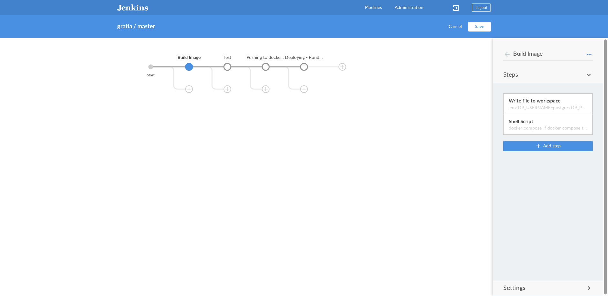
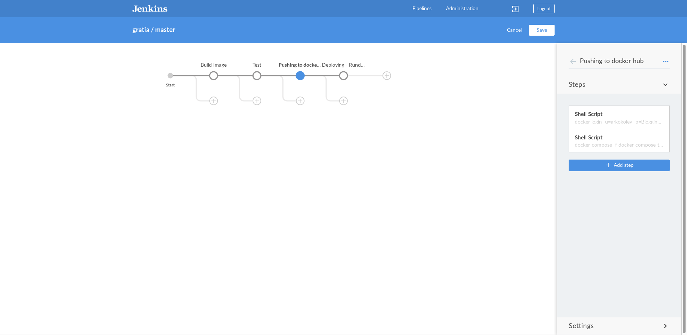
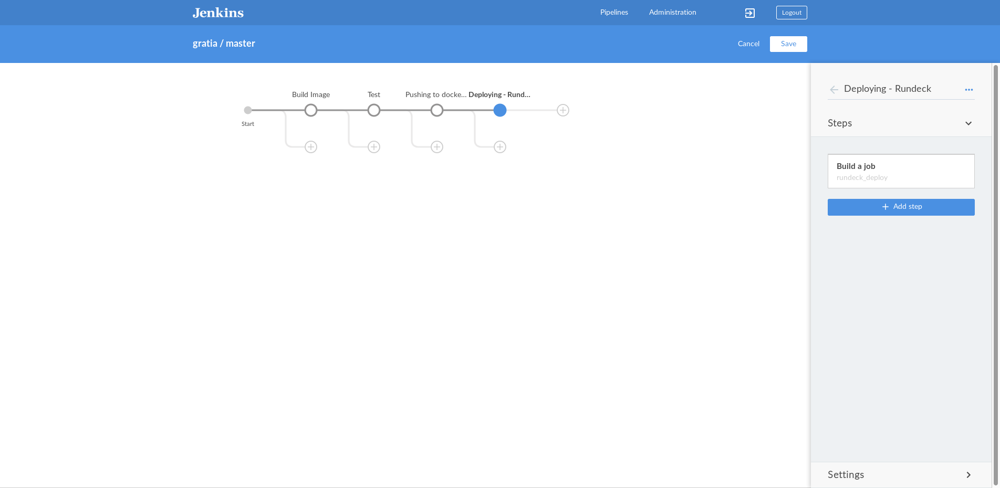
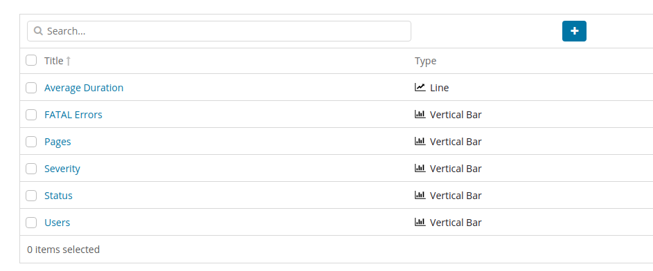
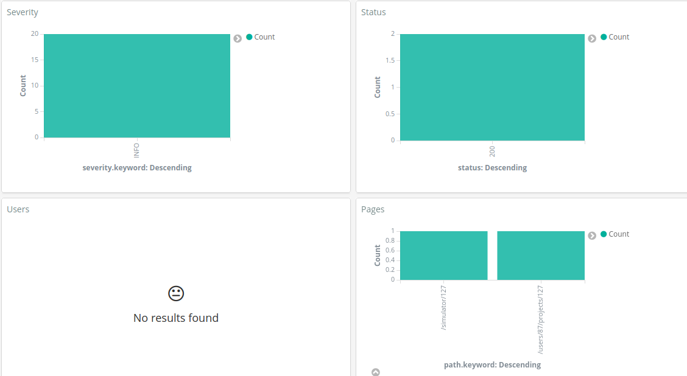
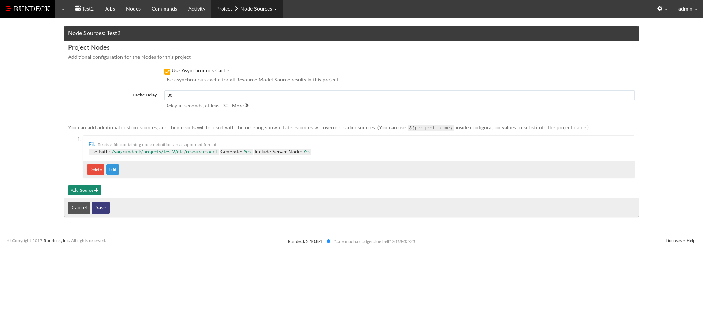
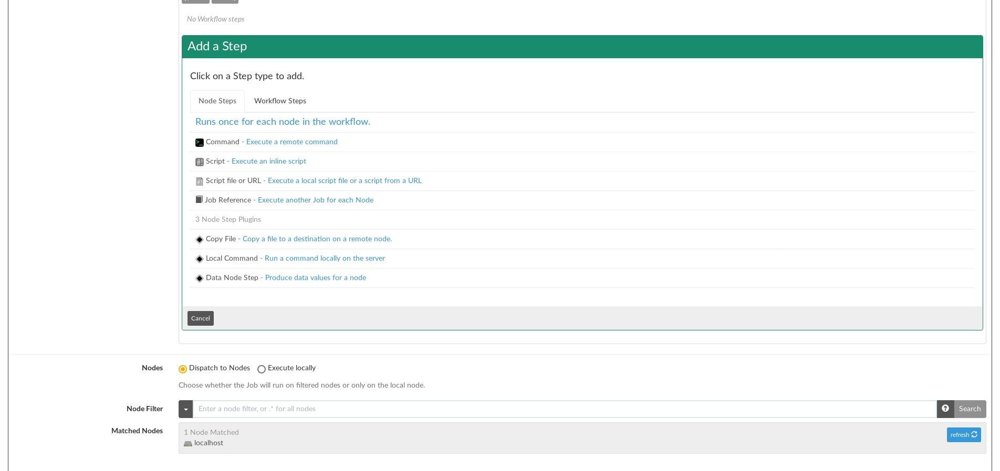
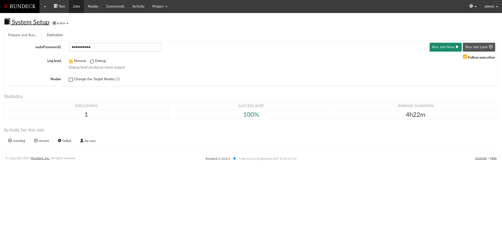

# Executive Summary
This report provides an insight into a Software Development LifeCycle(SDLC) for a web based product, Gratia. Using various Open Source DevOps tools such as Jenkins, Rundeck and the ELK stack, a one step build-deploy-monitor pipeline was setup. All code for the setup can be found in the appendices. Results of this report indicate that the code deployment time for the product was significantly reduced, enabling multiple deploys in a day.

# Steps in Project
* Tools to Install:
    1. Install Docker.
    2. Install Jenkins.
    3. Install Rundeck.
    4. Install ELK stack.

* Tools to Setup:
    1. Using docker to run Jenkins.
    2. Setting up Jenkins for pipeline.
    3. Integrating Jenkins with Rundeck.
    4. Connecting ELK stack with application.

The above steps are very abstract of what we are going to do in this building continuous integration(CI) and continuous delievery(CI) pipeline. Each of these steps contains various configurations for setting up the pipeline.

# About the Application

Gratia is a web based product. Its a platform where users can upload documents which can be read by other users. To read a document, users need to give "gratia" tokens to the uploader. Each user gets 1440 tokens in a day to spend on reading documents. At the end of the day, unused tokens expire and new 1440 tokens are issued to the user at midnight each day.

The project uses a Ruby on Rails back-end, a VueJS based front-end and PostgreSQL as its database. Solr, a search engine based on Lucene is used to provide search capabilities. 

# Software Development LifeCycle

!dot(imagename)(Software Development Life Cycle)
~~~~~
digraph {
  rankdir=LR;
  "SCM" -> "Build";
  "Build" -> "Testing";
  "Testing" -> "Artifact";
  "Artifact" -> Deployment;
  Deployment -> Monitoring;
}
~~~~~

The Software Development LifeCycle for Gratia is orchestrated by Jenkins which manages the entire lifecycle from code checking in the SCM to the deployment on the production servers. Rundeck which is used to do continuous deployment. Jenkins with Rundeck enables the product developers to do continuous integration and continuous deployment. Apart from Jenkins, the ELK stack is used to enable continuous monitoring.

## Installing tools:

### Installing docker:
To install docker follow this [installation guide](https://docs.docker.com/install/) and choose the setup for your operating system accordingly. 

### Installing Jenkins:
This project uses blueocean jenkins docker image. To install and setup Jenkins use the command below. It will pull the jenkins docker image from docker hub and run a container using that image. Do not directly copy paste the command it may not work, remove "\" and put in single line.

```shell
$ docker run \
  --rm \
  -u root \
  -p 8080:8080 \
  -v jenkins-data:/var/jenkins_home \ 
  -v /var/run/docker.sock:/var/run/docker.sock \
  -v "$HOME":/home \ 
  jenkinsci/blueocean

```

The above method is for linux users for Windows and Mac users follow this [link](https://jenkins.io/doc/tutorials/build-a-node-js-and-react-app-with-npm/#run-jenkins-in-docker). The below pipeline is made on the blueocean jenkins container.

### Installing Rundeck:

To install and setup Rundeck, follow the instructions in Appendix 4.

### Installing ELK Stack:

Using Docker and docker-compose we setup ELK stack for the Gratia production environment. There is already a docker compose file available to install ELK stack. 

To install and run the stack, run the following commands:

```sh
# Clone a git repository containing necessary configuration files
$ git clone https://github.com/deviantony/docker-elk.git elk
$ cd elk
$ docker-compose up -d
```
The last command runs the ELK stack using docker-compose. After this command ELK stack will be up and running. You can see all the services running using the ports below:
* 5000: Logstash TCP input.
* 9200: Elasticsearch HTTP
* 9300: Elasticsearch TCP transport
* 5601: Kibana

Gratia generates log in form of json. To fix configuration for Logstash to support json input.

`vi logstash/pipeline/logstash.conf`

and add `codec => "json_lines"` to the line below `port => 5000`.


## Role of Docker
Docker is a contianer management tool used to manage container. Using docker we can create, start, stop and delete container. There are multiple functionalities which docker provide. Docker container are based on linux kernel concepts of cgroups and namespaces. Cgroups which is control group is used to control the resources provided to docker container and namespaces deals with the isolation of the container from the host system. Before docker LXC container were used which were dificult to manage and due to direct interaction of developer with the kernel code to perform basic functionalities. 

Docker is an integral part of how the product Gratia is developed and deployed. The Dev and Ops teams share a commong configuration using a `Dockerfile` and a `docker-compose.yml`. This allows the devs to work with the same environment and system configuration as the production servers. With Docker, all the development can take place in predefined docker containers. If the code works on a container in the dev's machine, it will work the same on the production servers managed by the Ops team. This allows the devs to take ownership of their code and creates transparency of the deployment process.

Docker is used for development of Gratia as well running all the other services such as Jenkins and the ELK stack. 

The above method is for linux users for Windows and Mac users follow this [link](https://jenkins.io/doc/tutorials/build-a-node-js-and-react-app-with-npm/#run-jenkins-in-docker). The below pipeline is made on the blueocean jenkins container.


One Jenkins is installed we will understand the various steps which are there in the Jenkins pipeline. These steps will same to all except configuration may differ. 

## Role of Jenkins:
Jenkins is a tool used for continuos integration and connecting it with a continuous deployment tool which is Rundeck here. For this project we are using Jenkinfile instead of doing everything in jenkins dashboard we are using this file for configuration. This helps if other developers wants to setup the same project, they can use Jenkinsfile and install the plugins and it is ready to go. It is more preferable to use Jenkinsfile for the project.

All the steps in CI are mentioned below: 

## SCM
SCM stands for source code management and used for managing the source code of the application. For this project source code is stored in a git repository hosted on GitHub at [arkokoley/gratia](https://github.com/arkokoley/gratia).

As and when a commit is pushed to the repository, a *post commit hook* notifies Jenkins and the aforementioned deployment pipeline is started. Here we are using pollSCM which checks git repository after a interval and if there is a change in the code it triggers the pipeline otherwise it doesn't do anything. 

```shell
  # Jenkinsfile
  triggers {
    pollSCM('* * * * *')
  }
```

This will check the git repository every minute. To understand about the syntax used with poll scm use this [link](https://crontab.guru/#*_*_*_*_*).

## Build

Gratia is a Ruby on Rails project, configured to be deployed as a Docker container. We use a `Dockerfile` to setup the Gratia docker image. The file is available in Appendix 1. The `Dockerfile` is very generic to Ruby on Rails projects and can be easily adapted for other projects and their specific needs.

Addtionally, we run a few other services along with Gratia on which it is dependent. This is managed through Docker Compose using the following
`docker-compose.yml` configuration file. In case you are not using any other service like Solr, Mysql etc. then there is no need to setup this.

```shell
    # Jenkinsfile
    stage('Build Image') {
          steps {
            writeFile(file: '.env', text: 'DB_USERNAME=postgres
            DB_PASSWORD=thanks123 RAILS_ENV=test NODE_ENV=test')
            sh 'docker-compose -f docker-compose-test.yml build'
          }
        }

```


## Testing

For Gratia, we use [Rspec](http://rspec.info/) to do Behavioural Testing. We
wrote a total of 54 test cases covering various behaviours of the different
models of Gratia. Of these 54, 6 were pending fixes and the other 48 test cases
were passed. If you are using rails application Rspec is a great tool for you. 

There are other open source tools like Jest, Mocha, Chai which are available to use as per application requirement. 

To run the tests, we utilise a separate docker-compose configuration file
(`docker-compose-test.yml`) which contains the right environment configuration for the testing environment. Or you can directly use the `bundle exec rspec` command if your application does not depend on various services. Figure 4 shows the results for a commit passing all the test cases.


```shell
    # Jenkinsfile
    stage('Test') {
          steps {
            sh '''
    docker-compose -f docker-compose-test.yml run -e RAILS_ENV=test web bundle exec rspec
    '''
          }
        }
```


## Artifact 

The artifact, which in our case is a docker image is hosted in the Docker Hub
at [arkokoley/gratia](https://hub.docker.com/r/arkokoley/gratia/). For the first time it uploads the complete image and for further changes in the image docker just uploads the diff instead of uploading the complete image. Which decreases the deployment time significantly.  

```shell
    # Jenkinsfile
    stage('Pushing to docker hub') {
          steps {
            sh 'docker login -u=arkokoley -p=<password>'
            sh 'docker-compose -f docker-compose-test.yml push'
          }
        }
```


## Deployment

Rundeck is a open source tool used for continuous deployment. We are using [Rundeck](https://www.rundeck.com/open-source) to manage automated deployments on our production server which is managed by Zense(Developers group of IIITB). 

This step will be a integration of 3 steps:
1. Creating stage in Jenkinsfile.
2. Integrating Rundeck job with Jenkins.
3. Creating job in Rundeck.

### Creating stage in Jenkinsfile

While creating pipeline in Jenkins. We need to trigger a build step. This is as per the convention of Jenkinsfile which is different from pipeline build step. 
```shell
     # Jenkinsfile
     stage('Deploying - Rundeck') {
          steps {
            build 'rundeck_deploy'
          }
     }
```


### Integrating Rundeck job with Jenkins

Install the Rundeck plugin from Jenkins plugin manager. And further use this [link](http://www.techpaste.com/2016/10/integrating-jenkins-with-rundeck/) to setup Rundeck configuration in Jenkins.

* After seting up Rundeck configuration,  create a new Jenkins job in Jenkins by using `new item` from the dashboard. Select freestyle project and give the name of the job same as given above `rundeck_deploy`. 

* Go inside the above created job and in Post-build actions select Rundeck. In that give the UUID of the Rundeck job and click on save.


### Complete Pipeline in Jenkins Dashboard
The Complete Pipeline looks like this:


### Creating job in Rundeck
We make use of the following Rundeck Job to deploy the latest docker image for Gratia:

```sh
# Shut down and remove existing containers
docker-compose down

# Pull Latest docker-compose.yml file
wget https://raw.githubusercontent.com/arkokoley/gratia/master/docker-compose-prod.yml \
-O docker-compose.yml

# Pull latest docker image
docker pull arkokoley/gratia

# Build new container
docker-compose up -d
```

### Jenkins file for the complete CD:

Appendix 3 has the complete Jenkins file for the above CD. There are various stages and each stage has steps. 

## Monitoring

We use the [ElasticSearch, Logstash and Kibana (ELK)](https://www.elastic.co/elk-stack) stack to continuously monitor Gratia in production.

### Configure Ruby on Rails for ELK

Since Gratia is a Ruby on Rails project, a few code changes are needed to
ensure that the logs are sent to Logstash as well as available in the log
files. 

This is done by following the given steps:

1. Add the following gems to `Gemfile` for logging.

```ruby
  # Gemfile 
  # For Logging
  gem 'lograge'
  gem 'logstash-event'
  gem 'logstash-logger'
```


2. Add the following lines to `config/environments/production.rb`:

```ruby

  config.log_level = :info

  # Prepend all log lines with the following tags.
  config.log_tags = [ :request_id ]
  # Logstash settings start here
  config.lograge.enabled = true
  config.lograge.keep_original_rails_log = true
  config.lograge.custom_payload do |controller|
  {
      host: "Gratia",
      user_id: controller.current_user.try(:id)
  }
  # The host option looks very interesting to be used with devise gem maybe
  end
  config.lograge.formatter = Lograge::Formatters::Logstash.new
  # Optional, defaults to '0.0.0.0'
  config.logstash.host = ENV['LOGSTASH_HOST']  # Required, the port to connect to
  config.logstash.port = 5000  # Required
  config.logstash.type = :tcp
```

Optionally, repeat step 2 for other environments that may need logging.

### Configuring Kibana Dashboard
You can configure Kibana Dashboard by adding charts in visualize section, which can be be found on the left side of the drawer. As shown in Figure 9, Kibana already provides a charts and analysis tools which can be configured and added to a Kibana Dashboard.




We have created a Kibana Dashboard which gives us info about the number of users that came to the website and which page is visited most in the form of charts. As seen in Figure 10, the bottom right chart shows how many times a page was visited by the users and top right chart shows the number of users that came to the website in last day.




# Results and Discussion
Once the docker container image was deployed on Docker hub it was taking just 2 mins to complete the complete cycle. For the first time complete docker image is deployed on Docker hub but for further deployment it just deploys the diff.

# Future Work

Currently, the product has three configuration files for docker-compose which reflect the specific needs of the 3 environments - Production, Development and Testing. Moving forward, it would be ideal to migrate to a single docker-compose configuration file. 

Also, as of now, only the Ruby on Rails back-end is tested. In the future, the focus would be to write and run tests for the VueJS based front-end as well.

# Conclusion

This report describes a Software Development LifeCycle for a web based product Gratia. Open Source DevOps tools are used to automated various steps which involve stages from development to deployment. Use of these tools help create a one-step build and deploy mechanism which helps in faster and more frequent deploys.

\appendix

# Appendix 1 - Dockerfile 

```dockerfile
FROM ruby:2.4-alpine

RUN apk --update add --virtual\
  build-dependencies build-base libev libev-dev postgresql-dev nodejs bash\
  tzdata sqlite-dev git curl 

# for yarn
RUN npm install -g yarn 
WORKDIR /app
ADD .gemrc /app
ADD Gemfile /app/
ADD Gemfile.lock /app/

ENV RAILS_ENV=development
ENV NODE_ENV=development

RUN bundle install --jobs 8

ADD package.json /app/

RUN yarn install

ADD . /app

EXPOSE 3000
CMD ["bundle", "exec", "rails", "s"]
```

# Appendix 2 - Docker-compose.yml

```yaml
version: '3'
services:
  web:
    build: .
    image: arkokoley/gratia
    dns: "8.8.8.8"  # DO NOT REMOVE. Removing this breaks dns in the containers
    env_file: .env
    links:
      - db:db
      - solr:solr
      command: bash -c "bin/rake assets:precompile && \
                        bin/rake db:create && \
                        bin/rake db:migrate && \
                        bin/rails s"

  # In production remove this and add an external link in web
  db:
    image: postgres:latest
    environment:
      - POSTGRES_PASSWORD=thanks123
    volumes:
      - ./database:/var/lib/postgresql
  solr:
    image: solr:7.0.1
    volumes:
      - data:/opt/solr/server/solr/mycores
    entrypoint:
      - docker-entrypoint.sh
      - solr-precreate
      - development
    links:
      - db:db
volumes:
  data: {}
```
# Appendix 3 - Jenkinsfile

```shell
pipeline {
  agent any
  stages {
    stage('Build Image') {
      steps {
        writeFile(file: '.env', text: 'DB_USERNAME=postgres DB_PASSWORD=thanks123 RAILS_ENV=test NODE_ENV=test')
        sh 'docker-compose -f docker-compose-test.yml build'
      }
    }
    stage('Test') {
      steps {
        sh 'docker-compose -f docker-compose-test.yml run -e RAILS_ENV=test web bundle exec rspec'
      }
    }
    stage('Pushing to docker hub') {
      steps {
        sh 'docker login -u=arkokoley -p=<password>'
        sh 'docker-compose -f docker-compose-test.yml push'
      }
    }
    stage('Deploying - Rundeck') {
      steps {
        build 'rundeck_deploy'
      }
    }
  }
  post {
    always {
      echo 'I will always say Hello!'
    }
    
  }
  triggers {
    pollSCM('* * * * *')
  }
}
```

# Appendix 4 - Setup Rundeck

Requirements: Ubuntu, Java

1. Install Java:
```bash
sudo apt install openjdk-8-jdk
```

2. Download the latest run deck debian packages from this link
[http://rundeck.org/download/deb](http://rundeck.org/download/deb/)

3. Install the package using the following command
```bash
sudo dpkg -i {rundeck package name}
```

4. You can now start the Rundeck server using: 
```bash
sudo service rundeckd start
```

5. Now you can access the server at the url: [http://localhost:4440](http://localhost:4440)

You will see a login page. Login as:  

> Username: admin  
> Password: admin

6. Create a new project at the url:
[http://localhost:4440/resources/createProject](http://localhost:4440/resources/createProject)

Fill in the Name and Description and let all other details be set in their
default values and click **Create**.

7. Add Nodes/Clients to the Project  


Click on **Edit** for the Source file and mark the **Writable** option as
checked and Save.

You would now be able to edit the nodes file.

Edit the nodes file and add the following line:
```xml
  <node name="client" description="Client Node" tags=""
  hostname="Put Client Node IP Here" osArch="amd64" osFamily="unix" 
  osName="Linux" osVersion="4.13.0-36-generic" 
  username="Put Client Node User Here" sudo-command-enabled="true"
  sudo-password-option="option.sudoPassword"/>
```

Save the file.

8. **Authenticated access to the clients:** 
   Rundeck uses ssh with ssh keys to securely access the client nodes. We need
   to set up access keys for this to happen.

Run the following steps on your **rundeck server**:
```sh 
cd /var/lib/rundeck
mkdir -p .ssh
cd .ssh
sudo ssh-keygen
```

This will prompt you for a file name. Enter `id_rsa`. Just press enter for
the prompt "Enter passphrase". You will get something
similar to the following:

```sh
Generating public/private rsa key pair.

Enter file in which to save the key (/root/.ssh/id_rsa): id_rsa
Enter passphrase (empty for no passphrase): 
Enter same passphrase again: 
Your identification has been saved in id_rsa.
Your public key has been saved in id_rsa.pub.
The key fingerprint is:
SHA256:brKX0tb8fVkqcuiupNeQVMkRGJl/xZwyfAAJ8lK17eU root@arkokoley-PC
The keys randomart image is:
+---[RSA 2048]----+
|      . +O=B.+ . |
|       ++ =o+ *  |
|      . .o. .=.  |
|       .. ...o   |
|       .S. .. E  |
|       .o       .|
|      ..+* .   .o|
|      .** * o....|
|      o=.+o+.... |
+----[SHA256]-----+
```

You can now view the `id_rsa.pub` file via `cat id_rsa.pub`. We need to copy
the contents of this file to the client node.

Install and start ssh service on your **client node**:
```sh
sudo apt install ssh
sudo service ssh start
```

Copy the contents of `id_rsa.pub` file from the **rundeck server** and then perform the following operations in the **client node**:
```sh
cd ~
mkdir -p .ssh
cat >> ~/.ssh/authorized_keys
<Paste the contents of id_rsa.pub file from the rundeck server>

^C
```

Verify that the contents were copied properly by viewing the contents of
`~/.ssh/authorized_keys` in the **client node**.
```sh
cat ~/.ssh/authorized_keys
```

Now we can test that the Rundeck server is able to access the client node.
Go to (Assuming **"Test"** is the name of your project): 
[http://localhost:4440/project/Test/command/run](http://localhost:4440/project/Test/command/run)

In the `Nodes` input box, put in your client node name and click `Search`. Then
in the `Command` input box, type in the command `echo test` and then click `Run
on 1 Node`. You will be able to see the output `test` below.

9. **Create a Job**:

To create a Job, go to (Assuming your project name is **"Test"**):
[http://localhost:4440/project/Test/job/create](http://localhost:4440/project/Test/job/create)

Put in a Job Name, Description.

Earlier, when declaring our client node, we had put this piece of code: 
```xml
sudo-command-enabled="true" sudo-password-option="option.sudoPassword"
```

This allows us to input `sudo` passwords for different client nodes
on the go through the web GUI without having to store them in any config file. 

To make use of this feature, we create an `Option` in the Job form.

Set the option Name as "sudoPassword", the same as mentioned in the node file.
Set `Input Type` as "Secure" and click `Save`. 

Add any number of `Steps` in the Job workflow. All these steps will be run
sequentially.



Set `Nodes` to "Dispatch to Nodes" and Set the `Node Filter` if you want to
filter which nodes to run this job on.

Set the other options as required and click `Create` to save this job.

You can now open the Job and run it. Before you run, you can specify the sudo
password in the `sudoPassword`. 


