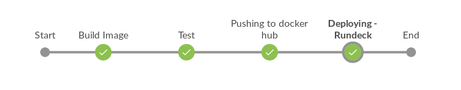
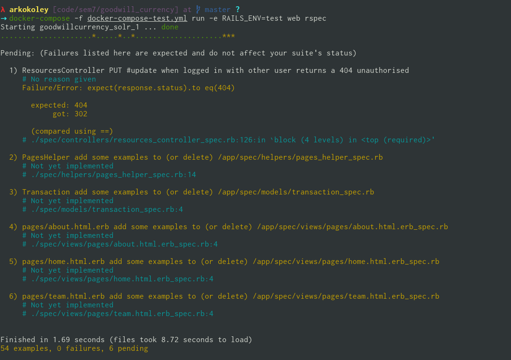

---------------------------------

# Executive Summary
Creating a Software Development LifeCycle(SDLC) using various tools for DevOps such as Jenkins, Rundeck and ELK stack. These tools are open source tools and can be used in any type of application SDLC.

# Software Development LifeCycle

!dot(imagename)(Software Development Life Cycle)
~~~~~
digraph {
  rankdir=LR;
  "SCM" -> "Build";
  "Build" -> "Testing";
  "Testing" -> "Artifact";
  "Artifact" -> Deployment;
  Deployment -> Monitoring;
}
~~~~~

## Setup for Jenkins:
The first tool to setup is Jenkins. This tool is used in creating the continuous integration and continuous deployment of pipeline. To install Jenkins on your system use jenkinsci/blueocean docker image. For this [docker](https://docs.docker.com/install/) should be installed previously in the system. Do not directly copy paste the command it may not work, remove "\" and put in single line. 
```sh
$ docker run \
  --rm \
  -u root \
  -p 8080:8080 \
  -v jenkins-data:/var/jenkins_home \ 
  -v /var/run/docker.sock:/var/run/docker.sock \
  -v "$HOME":/home \ 
  jenkinsci/blueocean
```
The above method is for linux users for Windows and Mac users follow this [link](https://jenkins.io/doc/tutorials/build-a-node-js-and-react-app-with-npm/#run-jenkins-in-docker). The below pipeline is made on the blueocean jenkins container.



One Jenkins is installed we will understand the various steps which are there in the Jenkins pipeline. These steps will same to all except configuration may differ. 

## SCM
SCM stands for source code management and used for managing the source code of the application. For this project source code is stored in a git repository hosted on GitHub at
[arkokoley/gratia](https://github.com/arkokoley/gratia).

## Build

Gratia is a Ruby on Rails project, configured to be deployed as a Docker container. We use the following `Dockerfile` to setup the Gratia docker image. For your project configuration may vary. But if you are deploying a rails application more or less it would be the same.

```dockerfile
FROM ruby:2.4-alpine

RUN apk --update add --virtual\
  build-dependencies build-base libev libev-dev postgresql-dev nodejs bash\
  tzdata sqlite-dev git curl 

# for yarn
RUN npm install -g yarn 
WORKDIR /app
ADD .gemrc /app
ADD Gemfile /app/
ADD Gemfile.lock /app/

ENV RAILS_ENV=development
ENV NODE_ENV=development

RUN bundle install --jobs 8

ADD package.json /app/

RUN yarn install

ADD . /app

EXPOSE 3000
CMD ["bundle", "exec", "rails", "s"]
```

Addtionally, we run a few other services along with Gratia on which it is
dependent. This is managed through Docker Compose using the following
`docker-compose.yml` configuration file. In case you are not using any other service like Solar, Mysql etc. then there is no need to setup this.

```yaml
version: '3'
services:
  web:
    build: .
    image: arkokoley/gratia
    dns: "8.8.8.8"  # DO NOT REMOVE. Removing this breaks dns in the containers
    env_file: .env
    links:
      - db:db
      - solr:solr
      command: bash -c "bin/rake assets:precompile && \
                        bin/rake db:create && \
                        bin/rake db:migrate && \
                        bin/rails s"

  # In production remove this and add an external link in web
  db:
    image: postgres:latest
    environment:
      - POSTGRES_PASSWORD=thanks123
    volumes:
      - ./database:/var/lib/postgresql
  solr:
    image: solr:7.0.1
    volumes:
      - data:/opt/solr/server/solr/mycores
    entrypoint:
      - docker-entrypoint.sh
      - solr-precreate
      - development
    links:
      - db:db
volumes:
  data: {}
```

## Testing

For Gratia, we use [Rspec](http://rspec.info/) to do Behavioural Testing. We
wrote a total of 54 test cases covering various behaviours of the different
models of Gratia. Of these 54, 6 were pending fixes and the other 48 test cases
were passed. If you are using rails application Rspec is a great tool for you. 

To run the rests, we utilise a separate docker-compose configuration file
(`docker-compose-test.yml`) which contains the right environment configuration for the testing environment. Or you can directly use Rspec command if your application does not depend on various services.


## Artifact 

The artifact, which in our case is a docker image is hosted in the Docker Hub
at [arkokoley/gratia](https://hub.docker.com/r/arkokoley/gratia/).

## Deployment

We use [Rundeck](https://www.rundeck.com/open-source) to manage automated
deployments on our production server which is managed by Zense.

We make use of the following Rundeck Job to deploy the latest docker image for Gratia:

```sh
# Shut down and remove existing containers
docker-compose down

# Pull Latest docker-compose.yml file
wget https://raw.githubusercontent.com/arkokoley/gratia/master/docker-compose-prod.yml \
-O docker-compose.yml

# Pull latest docker image
docker pull arkokoley/gratia

# Build new container
docker-compose up -d
```
### Jenkins file for the complete CD:
The below file is the complete Jenkins file of the above CD. There are various stages and each stage has steps. 

```sh
pipeline {
  agent any
  stages {
    stage('Build Image') {
      steps {
        writeFile(file: '.env', text: 'DB_USERNAME=postgres DB_PASSWORD=thanks123 RAILS_ENV=test NODE_ENV=test')
        sh 'docker-compose -f docker-compose-test.yml build'
      }
    }
    stage('Test') {
      steps {
        sh 'docker-compose -f docker-compose-test.yml run -e RAILS_ENV=test web bundle exec rspec'
      }
    }
    stage('Pushing to docker hub') {
      steps {
        sh 'docker login -u=arkokoley -p=<password>'
        sh 'docker-compose -f docker-compose-test.yml push'
      }
    }
    stage('Deploying - Rundeck') {
      steps {
        build 'rundeck_deploy'
      }
    }
  }
  post {
    always {
      echo 'I will always say Hello!'
    }
    
  }
  triggers {
    pollSCM('* * * * *')
  }
}
```

## Monitoring

We use the [ElasticSearch, Logstash and Kibana (ELK)](https://www.elastic.co/elk-stack) stack to continuously
monitor Gratia in production.

### Setup the ELK Stack

Using Docker and docker-compose we setup ELK stack for the Gratia production
environment.

To do so, run the following commands:

```sh
# Clone a git repository containing necessary configuration files
git clone https://github.com/deviantony/docker-elk.git elk
cd elk
```

fix configuration for Logstash to support json input

`vi logstash/pipeline/logstash.conf`

and add `codec => "json_lines"` to the line below `port => 5000`.


Run the ELK stack using `docker-compose up -d`

### Configure Ruby on Rails for ELK

Since Gratia is a Ruby on Rails project, a few code changes are needed to
ensure that the logs are sent to Logstash as well as available in the log
files. 

This is done by following the given steps:

1. Add the following gems to `Gemfile` for logging.

```ruby
  # Gemfile 
  # For Logging
  gem 'lograge'
  gem 'logstash-event'
  gem 'logstash-logger'
```


2. Add the following lines to `config/environments/production.rb`:

```ruby

  config.log_level = :info

  # Prepend all log lines with the following tags.
  config.log_tags = [ :request_id ]
  # Logstash settings start here
  config.lograge.enabled = true
  config.lograge.keep_original_rails_log = true
  config.lograge.custom_payload do |controller|
  {
      host: "Gratia",
      user_id: controller.current_user.try(:id)
  }
  # The host option looks very interesting to be used with devise gem maybe
  end
  config.lograge.formatter = Lograge::Formatters::Logstash.new
  # Optional, defaults to '0.0.0.0'
  config.logstash.host = ENV['LOGSTASH_HOST']  # Required, the port to connect to
  config.logstash.port = 5000  # Required
  config.logstash.type = :tcp
```

Optionally, repeat step 2 for other environments that may need logging.

### Configuring Kibana Dashboard


# Results and Discussion
Once the docker container image was deployed on Docker hub it was taking just 2 mins to complete the complete cycle. For the first time complete docker image is deployed on Docker hub but for further deployement it just deploys the diff.

# Future Work
To create a generic pipeline for various type of applications which can directly be used by the open source project and they do not need to configure it again and again. 

# Conclusion
This SDLC helped us in understanding various steps which happens in during development to deployment. 
